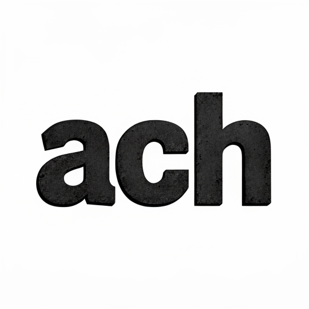

<p align="center">
  
</p>

<h1 align="center">Astro Content Hub</h1>

<p align="center">
  <a href="./LICENSE"></a>
  <a href="https://astro.build/"></a>
  <a href="https://nodejs.org/"></a>
</p>

<p align="center">A content-hub template: aggregate documentation and blog posts from many<br>repositories into one <strong>localized, auto-deployed static site</strong>.</p>

---

Built with [Astro 7](https://astro.build/) (static output). Content ships through
**pull requests**, so nothing lands on `main` without review. It deploys for
free to GitHub Pages and Cloudflare Pages.

> **One hub, many source repos.** External projects author `posts/` and
> `docs/`, a GitHub Action validates the content and opens a PR, a human
> reviews it, and the hub builds and deploys.

## Table of contents

- [What it is](#what-it-is)
- [Features](#features)
- [Architecture](#architecture)
- [Quick start](#quick-start)
- [Authoring content](#authoring-content)
- [Extending the hub](#extending-the-hub)
- [Project structure](#project-structure)
- [Documentation](#documentation)
- [Contributing](#contributing)
- [Security](#security)
- [License](#license)

## What it is

`astro-content-hub` is a **content-hub template**. Instead of scattering docs
and blog posts across every repository, you run one hub site that aggregates
content from many sources. Each source repo keeps its own `posts/` and `docs/`
and syncs them into the hub through a pull request - so a human reviews every
change before it publishes.

The result is a single, fast, localized static site with:

- **Aggregated content** from many repos, reviewed before it ships.
- **Per-page internationalization** with graceful fallback (never a 404 on a
  missing translation).
- **Data-driven products** - add a product with one line of config and its
  routes, sidebar, and landing card are generated automatically.
- **Free deployment** to GitHub Pages and Cloudflare Pages.

The template ships with sample content (Vite, Astro, JSON Server docs) so the
site looks complete out of the box. Replace it with your own.

## Features

- **Hub + content-sync model.** The hub site lives in this repo. External
  projects author content and sync it in via a GitHub Action that opens a PR.
  One hub, many source repos, nothing on `main` without review.
- **i18n with per-page fallback.** Default locale `en` has no URL prefix;
  other locales live under `/<locale>/...` (currently `zh-Hans`). A missing
  translation renders the default-language body inside the localized shell -
  never a 404. Ship `en` first, translate incrementally.
- **Data-driven products.** Products come from the `products` array in
  [`src/config/products.ts`](./src/config/products.ts). Add an entry and the
  product landing page, docs routes, and sidebar are generated automatically -
  no per-product route files. A product can optionally ship a custom landing
  page by adding one component (see
  [Customize a product landing](#customize-a-product-landing)).
- **Typed content collections.** Posts and docs are Markdown loaded from the
  filesystem with [zod](https://zod.dev/)-validated frontmatter, so malformed
  content fails the build before it reaches the site.
- **Relative links that just work.** A build-time Markdown plugin rewrites
  GitHub-friendly relative `.md` links (`./getting-started.md`) into the
  correct hub routes, so source files keep working on GitHub *and* on the site.
- **Zero-config styling.** One global stylesheet on CSS custom properties,
  plus shared `.prose` typography for all rendered Markdown. No Tailwind, no
  CSS-in-JS, no UI framework - just small `.astro` components.
- **Base-path aware.** Builds root-absolute links through a `withBase()`
  helper, so the same site works at a site root (custom domain, Cloudflare
  Pages) or a GitHub Pages project path (`/<repo>/`).
- **Free auto-deploy.** A manual workflow builds `dist/` and publishes to
  GitHub Pages and (optionally) Cloudflare Pages at no cost.

### SEO & discoverability

- **Canonical URLs** on every page (correct under a sub-path deploy).
- **Sitemap** (`/sitemap-index.xml`) via `@astrojs/sitemap`, with `hreflang`
  `en`/`zh-Hans` grouping.
- **RSS feed** at `/rss.xml` (en) and `/zh-Hans/rss.xml` (zh-Hans), with feed-discovery
  `<link>` in the `<head>`.
- **Machine-readable corpus** at `/llms.txt` and `/llms-full.txt`
  ([llmstxt.org](https://llmstxt.org/) convention) so AI tools and agents can
  discover and ingest the aggregated content without scraping.
- **`robots.txt`** pointing at the sitemap.
- **Custom 404 page** (excluded from the sitemap).

### Reading UX

- **Dark mode** with system-preference default and a manual toggle persisted
  to `localStorage`; no flash of the wrong theme on load.
- **Docs table of contents** - a right-rail TOC from heading anchors, with
  active-section highlighting.
- **Prev/next pagination** on docs, **copy-code buttons** on every code block,
  and **heading anchor links** (`#` beside each heading) across docs and posts.

### Content discovery

- **Tag pages** at `/posts/tags/[tag]` (+ `/zh-Hans/` twin), with a tag chip row on
  the posts listing and clickable tags on every post card.
- **Related posts** on article pages (by shared tags).
- **Post breadcrumbs** (`Home / Posts / <title>`).

## Architecture

The hub is an Astro 7 static site (`output: 'static'`). Everything is
prerendered to `dist/` and served as plain static files.

```mermaid
flowchart TD
    A["source repo: my-posts<br/>posts/en · posts/zh-Hans"]
    B["source repo: vite-docs<br/>docs/en · docs/zh-Hans"]

    A -->|"GitHub Action<br/>validate + open PR"| HUB
    B -->|"GitHub Action<br/>validate + open PR"| HUB

    subgraph HUB["astro-content-hub - this repo"]
        C["aggregated posts<br/>src/content/posts/&lt;locale&gt;/"]
        D["aggregated docs<br/>src/content/docs/&lt;product&gt;/&lt;locale&gt;/"]
        E["Astro build -> dist/"]
        C --> E
        D --> E
    end

    E --> GH["GitHub Pages"]
    E --> CF["Cloudflare Pages"]
```



Key pieces:

- **Routing** is file-based under `src/pages/`. Product pages are *dynamic*
  (`src/pages/[product]/...`), so one set of route files serves every product.
  Non-default locales are served by universal `src/pages/[locale]/...` routes.
- **Content collections** are defined declaratively in
  [`src/content.config.ts`](./src/content.config.ts), which loops
  `products × locales` (docs) and `locales` (posts, product landing info) to
  generate collections.
- **i18n** has a single source of truth in
  [`src/lib/i18n.ts`](./src/lib/i18n.ts): `locales`, UI strings (`t`), landing
  copy (`home`), and path/locale helpers.
- **Fallback** lives in [`src/lib/content.ts`](./src/lib/content.ts): a missing
  localized page renders the default-locale body inside the localized shell.

For the full breakdown - layout composition, the routing table, the `src/lib/`
module reference, and conventions - read
[Architecture](./docs/en/architecture.md).

## Quick start

### Prerequisites

- **Node.js 22** (matches the deploy workflow). Use `npm`.
- A GitHub account if you want to deploy via the included workflow.

### Run the hub locally

```bash
git clone https://github.com/awareride/astro-content-hub.git
cd astro-content-hub
npm install
npm run dev
```

The dev server prints a local URL (default `http://localhost:4321/`).
Open it to browse the hub with the sample content.

### Build for production

```bash
npm run build
```

This runs `astro check` (type check) and builds the static site to `dist/`.
The build must pass with **0 errors**. Preview it locally with
`npm run preview`.

### Deploy

The hub deploys for free to GitHub Pages and Cloudflare Pages via a manual
workflow (`.github/workflows/deploy.yml`). To point the template at your own
infrastructure, see [Deployment](./docs/en/deployment.md).

The sample posts and docs are placeholders - delete the files under
`src/content/` and add your own (see [Authoring content](#authoring-content)).

## Authoring content

Content is Markdown in `src/content/`, organized by locale. The default locale
`en` has no URL prefix; `zh-Hans` lives under `/zh-Hans/...`.

**Blog posts** live in `src/content/posts/<locale>/`:

```yaml
---
title: "Post Title"            # required
date: 2025-07-21               # required, YYYY-MM-DD
description: "One-line summary."  # required
tags: ["announcement"]         # optional
author: "Your Name"           # optional
draft: false                  # optional; drafts are excluded
---

Your post body in Markdown.
```

**Product docs** live in `src/content/docs/<product>/<locale>/`:

```yaml
---
title: "Page Title"          # required
description: "Short summary" # optional
order: 2                     # optional, controls sidebar sort (default 0)
---
```

Two rules that matter:

1. **Slug contract.** A file's slug is its path relative to the locale dir,
   without `.md`. Filenames **must be byte-identical across locales** so
   fallback works (`en/foo.md` and `zh-Hans/foo.md` both have slug `foo`). Always
   write the `en` version first.
2. **Internal links.** Inside a localized (`zh-Hans`) page, link to `/zh-Hans/...` paths
   so readers stay in the localized shell.

For the complete guide - frontmatter schemas, the `index` slug special case,
adding a product or locale, and verification steps - read
[Authoring content](./docs/en/authoring.md).

## Extending the hub

### Add a product

The only extension that touches config. Register the product in
[`src/config/products.ts`](./src/config/products.ts):

```ts
export const products: Product[] = [
  // ...existing...
  { slug: 'mytool', name: 'MyTool', github: 'https://github.com/owner/mytool', badges: ['Tool'], nav: false },
];
```

This auto-generates the `mytoolDocsEn` / `mytoolDocsZhHans` collections, a landing
card, and the docs routes. Then add content:

```
src/content/docs/mytool/en/index.md
src/content/docs/mytool/en/getting-started.md
src/content/docs/mytool/zh-Hans/index.md   # optional; falls back to en
```

Routes are dynamic, so no new route files are needed. Run `npm run build` and
verify `/mytool/docs/` and `/zh-Hans/mytool/docs/` render.

### Customize a product landing

By default every product landing (`/<product>/`) renders the shared generic
hero + CTA in
[`src/components/ProductLandingDefault.astro`](./src/components/ProductLandingDefault.astro).
To ship a custom landing for one product, add a single component keyed by the
product **slug**:

```
src/components/product-landing/<slug>.astro     # e.g. src/components/product-landing/vite.astro
```

[`src/lib/product-landing.ts`](./src/lib/product-landing.ts) eagerly globs
that directory at build time, so the file is auto-discovered - no config, no
route changes. Both landing routes (the default `/<product>/` route and its
`/<locale>/<product>/` twin) pick up the override automatically; products
without a matching file keep the generic landing. Docs subroutes
(`/<product>/docs...`) are unaffected and stay data-driven.

The override renders **only the `<main>` sections** (hero, custom sections,
CTA). The route still owns `Layout` + `Nav` + `Footer` and the `<head>`, so
there is no second document shell. It receives the same props as the fallback:

| Prop | What it is |
|------|------------|
| `product` | The full `Product` entry from `src/config/products.ts`. |
| `locale` | Current locale (`'en'` from the default route, the loop value from the twin). |
| `c` | Locale-resolved UI strings (`ProductCopy`) - reuse `c.viewSource`, `c.documentation`, `c.ctaTitle`, ... |
| `docsHref` | Base-aware, locale-prefixed docs link, pre-computed by the route. |

To localize override-only copy, branch on `locale` inside the component; v1
ships one override per product used across all locales (per-locale override
files like `vite.zh-Hans.astro` are a future extension). The worked example
[`src/components/product-landing/vite.astro`](./src/components/product-landing/vite.astro)
shows the contract - reuse shared CSS classes (`.product-hero`, `.section`,
`.btn`, `.feature-grid`, ...) and add a scoped `<style>` only when the global
classes do not fit.

**Auto-generated landings (no code).** Between the full override and the
minimal default, a product can ship a **structured landing** from a Markdown
file at `src/content/product-info/<locale>/<slug>.md`. Its frontmatter
(`tagline`, `features`, `install`, `highlights`, `links`, and an optional prose
overview body) renders a rich landing with no component code. A hand-written
override always takes precedence; with neither, the minimal default is used.

### Add a locale

Append to `locales` in [`src/lib/i18n.ts`](./src/lib/i18n.ts), add a block to
every `Record<Locale, …>` table (`t`, `home`, `productCopy`, `localeLabel`,
`localeCode`), and create the content dirs. **No route files are needed** -
non-default locales are served by universal `src/pages/[locale]/...` routes,
so adding a locale is a data-only change. See
[Authoring content - Add a new language](./docs/en/authoring.md#add-a-new-language).

### Sync content from an external repo

This is the core feature of the hub model. Instead of editing the hub repo
directly, an external project authors `posts/` or `docs/` and a GitHub Action
syncs them in via a PR:

```
<external-project>/
  posts/
    en/hello-world.md          <- /posts/hello-world/ on the hub
    zh-Hans/hello-world.md     <- same filename as en/ (slug contract)
  docs/
    en/index.md                <- product docs landing page
    en/getting-started.md
  landing/                      <- optional; one file per locale, auto-generated landing
    en.md
  .github/workflows/sync-posts.yml   <- copies posts/ into the hub on push
```

To set up your own source repo, copy one of the samples and fill in the
placeholders:

- **Posts:** [`examples/my-posts/`](./examples/my-posts) - see its
  [`README.md`](./examples/my-posts/README.md).
- **Docs:** [`examples/vite-docs/`](./examples/vite-docs),
  [`examples/astro-docs/`](./examples/astro-docs),
  [`examples/json-server-docs/`](./examples/json-server-docs) - each carries a
  `skills/site-content-sync/` skill and sync workflow templates.

Then add a fine-grained PAT as a repository secret on the *source* repo
(`DOCS_CENTRAL_HUB_TOKEN`), set the `<HUB_REPO>` / `PRODUCT` placeholders in
the workflow, and push. A PR opens against the hub's `main`; when merged, the
content builds and deploys. The copy is a **merge**, never a mirror, so it
never deletes other projects' content.

For the full flow - frontmatter schemas, the deletion manifest
(`sync-delete.list`), local validation, and registering a new product - read
[Content sync](./docs/en/content-sync.md).

### Customize the look

- **Brand tokens (colors, accent, fonts)** live in
  [`src/styles/theme.css`](./src/styles/theme.css) - the one file to edit to
  rebrand the site (light + dark). See [`THEMING.md`](./THEMING.md) for a
  guided walkthrough. **Sample themes** (e.g. an OpenAI-inspired palette) live
  in [`src/styles/themes/`](./src/styles/themes) - try one by swapping one
  `@import` line in `global.css`. **Structural tokens** (spacing, radius,
  shadows) stay in [`src/styles/global.css`](./src/styles/global.css) and rarely
  need changing; reuse them in scoped `<style>` blocks instead of hard-coded
  values.
- **Per-product themes** let one product (e.g. a "green" brand) override the
  site's color tokens for its landing + docs pages. Add
  `src/styles/product-themes/<slug>.css` (scoped to `html[data-product="<slug>"]`)
  and an `@import` in `product-themes/index.css`; product routes emit
  `data-product` automatically. See [`THEMING.md`](./THEMING.md).
- **Markdown typography** is the single `.prose` class in `global.css`. Wrap
  `<Content />` in `class="prose"` on any new Markdown-rendering page.
- **Site name / UI strings / landing copy** are in
  [`src/lib/i18n.ts`](./src/lib/i18n.ts) - replace the sample copy with yours.

## Project structure

```
astro-content-hub/                 <- the hub (Astro site) at the repo root
├── astro.config.mjs              <- set `site`/`base` to your domain
├── src/
│   ├── components/              <- Layout, Nav, Footer, DocsLayout, PostCard, LocaleSwitcher, ThemeToggle, TableOfContents, TagPage, ProductLandingDefault
│   ├── components/product-landing/  <- optional per-product landing overrides (one file per product, keyed by slug)
│   ├── config/products.ts       <- the products registry (add a product here)
│   ├── content/                 <- markdown collections (posts + docs + product-info)
│   ├── content.config.ts        <- collection schemas (zod) + glob loaders
│   ├── lib/                     <- i18n.ts, content.ts, docs.ts, feed.ts, product-landing.ts, remark-rewrite-links.mjs, heading-ids.mjs
│   ├── pages/                   <- file-based routes (+ [locale]/ universal routes)
│   ├── styles/global.css        <- structural tokens + .prose typography (+ theme.css for brand)
│   └── styles/product-themes/   <- optional per-product color themes (<slug>.css)
├── public/                      <- favicon, images, CNAME
├── docs/                        <- this template's own docs (synced into the hub)
├── examples/                    <- sample external repos that sync INTO the hub
│   ├── my-posts/                <- a posts example (en/zh-Hans)
│   ├── vite-docs/               <- a docs example (PRODUCT=vite)
│   ├── astro-docs/             <- a docs example (PRODUCT=astro)
│   └── json-server-docs/        <- a docs example (PRODUCT=json-server)
├── skills/site-content/         <- per-hub authoring skill
├── .github/workflows/           <- deploy.yml (GH Pages + CF Pages), sync-docs.yml
└── .github/ISSUE_TEMPLATE/      <- issue + pull request templates
```

## Documentation

This template's documentation lives in [`docs/en/`](./docs/en) (with a Chinese
mirror in [`docs/zh-Hans/`](./docs/zh-Hans)). It is also rendered on the live site at
[the `astro-content-hub` product docs](https://awareride.github.io/astro-content-hub/astro-content-hub/docs/).

| Page | What it covers |
|------|----------------|
| [Overview](./docs/en/index.md) | What the template is and why. |
| [Architecture](./docs/en/architecture.md) | Site layout, routing, content collections, key modules. |
| [Authoring content](./docs/en/authoring.md) | Write posts and docs in the hub: i18n, slug contract, fallback, adding a product/locale. |
| [Content sync](./docs/en/content-sync.md) | Contribute content from a separate repo via the PR-based sync Action. |
| [Deployment](./docs/en/deployment.md) | Point the template at GitHub Pages and/or Cloudflare Pages. |

The [`skills/site-content/SKILL.md`](./skills/site-content/SKILL.md) file is a
condensed authoring reference for working inside a hub repo.

## Contributing

Contributions are welcome - both **content** (posts and docs) and **code**
(the hub itself). Before opening a pull request, please read
[`CONTRIBUTING.md`](./CONTRIBUTING.md) for the local setup, content workflow,
build requirements, and pull-request checklist.

By participating, you agree to abide by the
[Code of Conduct](./CODE_OF_CONDUCT.md).

## Security

To report a security vulnerability, please follow the responsible-disclosure
process in [`SECURITY.md`](./SECURITY.md) - **do not** open a public issue for
security reports. For general questions and bugs, see
[`SUPPORT.md`](./SUPPORT.md).

## License

Content and code are released under the **MIT License**. See
[`LICENSE`](./LICENSE) for the full text.
